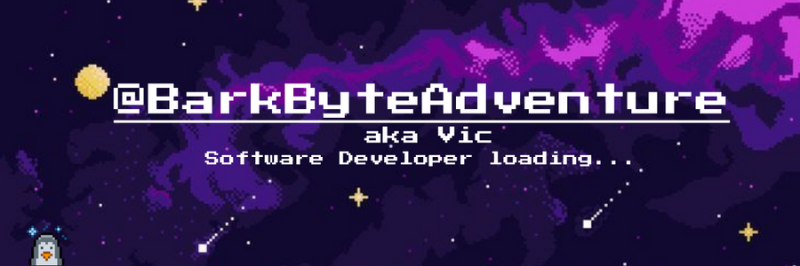

<h1>About me:</h1>

🔭 ... working on honing my skills as a frontend developer during my internship at a model agency  

🌱 ... currently learning Python and JavaScript to expand my coding toolkit.

👯 ... looking to collaborate on open-source projects that challenge and inspire creativity  

🤔 ... looking for help with mastering advanced web development techniques  

 

## Working with:

  

## My Codédex pet Barky:

  

 

## My Status:

⚡ Fun fact: I have a knack for turning ordinary walnuts into miniature works of art!

<h2>📫 How to reach me:
  
</h2>
 
